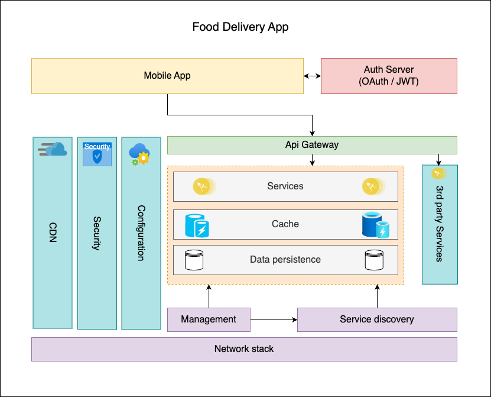

# BITS Api Based Products Assignment 2 - Group 1

# Design and Development of an API product for a Food Delivery System

## Objective

Design, develop, and deploy an API product for a Food Delivery System that allows customers to browse restaurants and menus, place orders, track deliveries, and manage accounts. Restaurants can manage their menus and orders, while delivery personnel can accept and track deliveries. Administrators can manage the platform’s users and orders. The assignment emphasizes secure design, user roles, data validation, and proper documentation.
Problem Context: You are tasked with creating a backend API for a food delivery platform. The platform will have different users, including customers, restaurant owners, delivery personnel, and administrators, each with specific actions they can perform. The API will allow customers to place orders, restaurants to manage menus, delivery personnel to handle deliveries, and administrators to oversee the system.

## Functional Requirements:

You are required to implement functionalities for each of the following user roles:

### 1. Customer Functionalities:

-   **Register/Login:** Customers can create an account, log in, and manage their profile (name, delivery address, payment details).
-   **Browse Restaurants:** Customers can browse a list of restaurants and view their menus.
-   **Search Menus:** Customers can search for specific food items or filter by restaurant type (e.g., cuisine, vegetarian options).
-   **Place an Order:** Customers can select items from a restaurant’s menu, add them to the cart, and place an order.
-   **Track Orders:** Customers can track the status of their orders (e.g., preparing, out for delivery, delivered).
-   **View Order History:** Customers can view a list of past orders and reorder from the same restaurant.

### 2. Restaurant Owner Functionalities:

-   **Register/Login:** Restaurant owners can create an account, log in, and manage their profile (restaurant name, address, hours of operation).
-   **Manage Menus:** Restaurant owners can add, update, or remove items from their restaurant’s menu, including details such as price, description, and availability.
-   **View Orders:** Restaurant owners can view incoming orders and update their status (e.g., order accepted, preparing, ready for delivery).
-   **Update Restaurant Details:** Restaurant owners can update the restaurant’s details, such as opening hours and delivery zones.

### 3. Delivery Personnel Functionalities:

-   **Register/Login:** Delivery personnel can create an account, log in, and manage their profile (name, contact details, vehicle type).
-   **View Available Deliveries:** Delivery personnel can view a list of available deliveries and accept orders for delivery.
-   **Track Delivery Status:** Delivery personnel can update the status of a delivery (e.g., picked up, en route, delivered).
-   **Manage Delivery Availability:** Delivery personnel can set their availability for receiving delivery requests.

### 4. Administrator Functionalities:

-   **Manage Users:** Administrators can create, update, or deactivate customer, restaurant owner, and delivery personnel accounts.
-   **View and Manage Orders:** Administrators can view all platform orders and manage them if necessary (e.g., cancelling, rescheduling).
-   **Generate Reports:** Administrators can generate reports on the system’s performance (e.g., most popular restaurants, average delivery time, order trends).
-   **Monitor Platform Activity:** Administrators can monitor overall platform health, including active users, delivery activity, and order statuses.

## Non-Functional Requirements:

-   **Role-Based Access Control (RBAC):** Implement secure role-based permissions. Ensure customers, restaurant owners, delivery personnel, and administrators can only access the parts of the API relevant to their role.
-   **Authentication and Authorization:** Implement token-based authentication (e.g., JWT). Ensure secure access to all endpoints, especially those handling sensitive information such as payment details.
-   **Data Validation:** Validate all inputs, such as delivery addresses, menu item availability, and payment details, to ensure proper functioning and avoid errors.
-   **Error Handling:** Implement proper error handling and return appropriate status codes
-   **API Documentation:** Document each API endpoint using tools like Swagger or Postman. The documentation should clearly describe the request methods, parameters, responses, and potential error messages.

## API Architectural style

Select the right style depends on the system’s requirements, scalability, and interaction needs.

## Development Environment:

Use a backend language/framework of your choice (e.g., Node.js with Express, Python with Flask/Django, Java with Spring Boot).
Use a database (e.g., MySQL, PostgreSQL, MongoDB) to store user, restaurant, and order data.
Implement security measures such as encryption for sensitive information (e.g., payment details, passwords).

## Testing and Deployment:

Write unit and integration tests to ensure that the API works as expected.
Use Postman or a similar tool to manually test each endpoint.
Deploy the API to a cloud platform (e.g., Heroku, AWS, Google Cloud) and provide a working URL.
Ensure that the API handles CORS requests to enable cross-origin access for web and mobile clients.

## Deliverables:

-   **API Codebase:** The complete code for the API following industry standards for clean and maintainable code through a GIT repository.
-   **API Documentation:** Comprehensive API documentation detailing all endpoints, request parameters, and responses.
-   **Deployed API:** Provide a URL to the deployed API for testing.
-   **Database Schema:** Provide a schema or ER diagram for the database.
-   **Test Cases:** Submit test cases and results from unit and manual testing.
-   **Report:** A brief report (2-3 pages) explaining key design choices, how role-based access is implemented, and how the API ensures data security.
-   **Demonstration Video:** A brief video demoing all the features implemented along with key design, implementation and deployment considerations.

## Tech Stack

-   Node.js
-   PostgreSQL
-   Postman

## Deployment

Application is deployed on https://www.heroku.com

## API collection workspace

https://api-based-products-assignment-2-group-1.postman.co/workspace/807c57bb-f347-410a-b8b6-0f143a33eff2/team-quickstart

## Demo video url

## Architecture

## Security

Services and APIs are secured by JWT and Role Based Access Control(RBAC)

## Team

-   KOLAMALA RAMESH - 2023mt93294@wilp.bits-pilani.ac.in
-   UJJWAL DEY - 2023mt93290@wilp.bits-pilani.ac.in
-   MOHD ILYAS AHMED - 2023mt93044@wilp.bits-pilani.ac.in
-   TITTU VARGHESE - 2023mt93398@wilp.bits-pilani.ac.in
