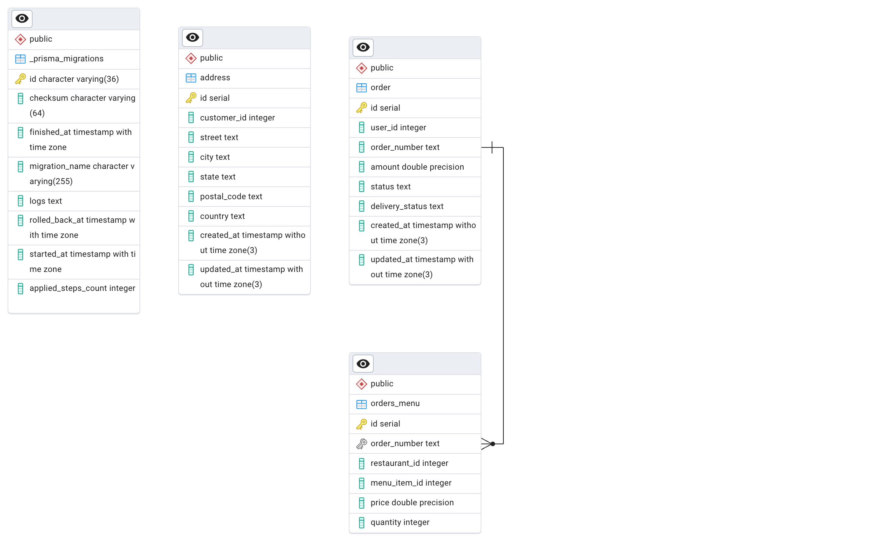
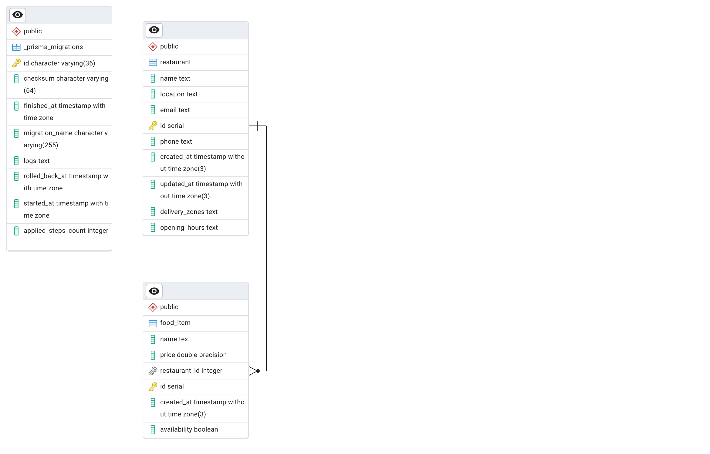
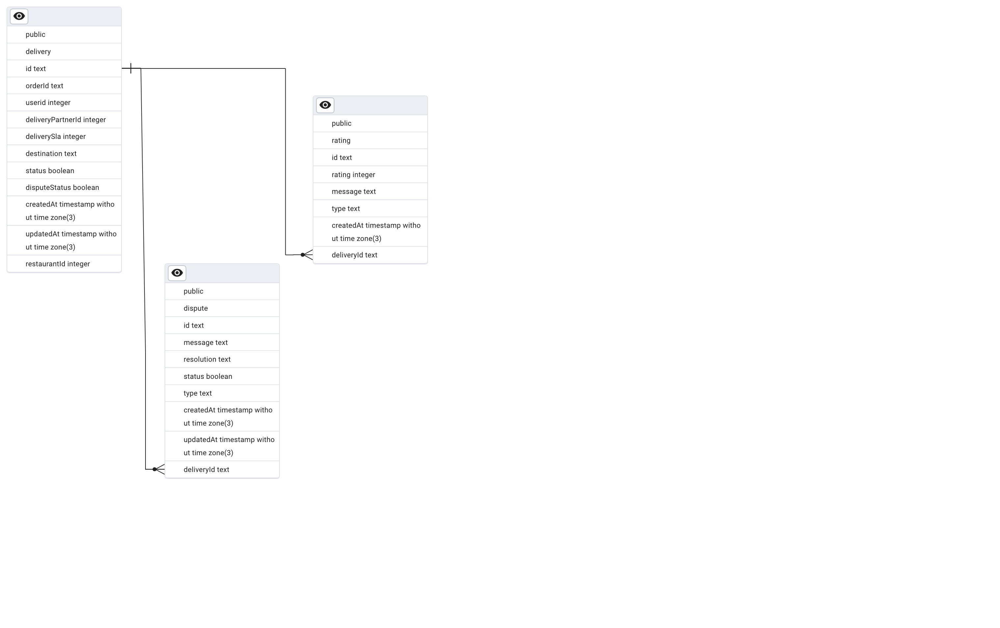
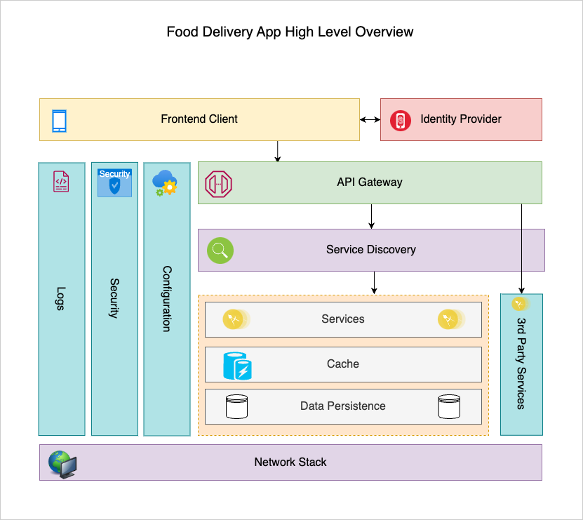
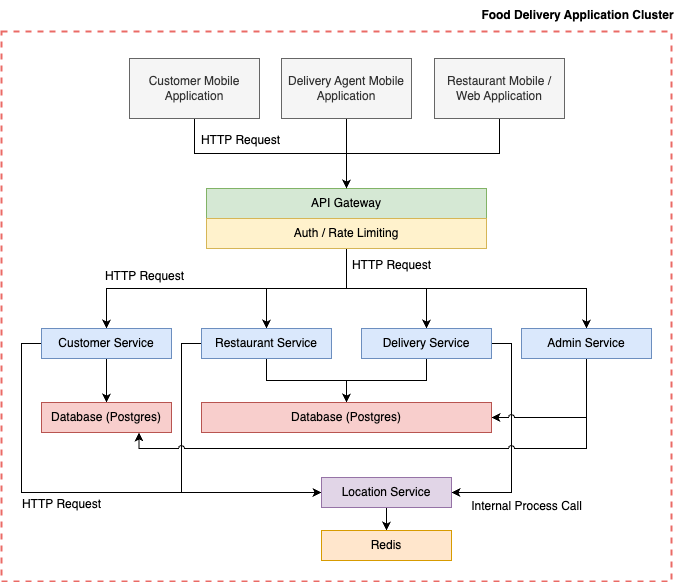

# BITS Api Based Products Assignment 2 - Group 1

## Team

-   KOLAMALA RAMESH - 2023mt93294[@]wilp.bits-pilani.ac.in
-   UJJWAL DEY - 2023mt93290[@]wilp.bits-pilani.ac.in
-   MOHD ILYAS AHMED - 2023mt93044[@]wilp.bits-pilani.ac.in
-   TITTU VARGHESE - 2023mt93398[@]wilp.bits-pilani.ac.in

## Components

-   [Gateway](./api-gateway-service/)
-   [Auth Service](./auth-service)
-   [Customer Service](./customers-service)
-   [Delivery Service](./delivery-service)
-   [Restaurant Service](./restaurant-service)
-   [Restaurant Owner Service](./resturent-owner-services)
-   [Administration Service](./administration-service)

# Design and Development of an API product for a Food Delivery System

## Objective

Design, develop, and deploy an API product for a Food Delivery System that allows customers to browse restaurants and menus, place orders, track deliveries, and manage accounts. Restaurants can manage their menus and orders, while delivery personnel can accept and track deliveries. Administrators can manage the platform’s users and orders. The assignment emphasizes secure design, user roles, data validation, and proper documentation.
Problem Context: You are tasked with creating a backend API for a food delivery platform. The platform will have different users, including customers, restaurant owners, delivery personnel, and administrators, each with specific actions they can perform. The API will allow customers to place orders, restaurants to manage menus, delivery personnel to handle deliveries, and administrators to oversee the system.

## Functional Requirements:

You are required to implement functionalities for each of the following user roles:

### 1. Customer Functionalities:

-   **Register/Login:** Customers can create an account, log in, and manage their profile (name, delivery address, payment details).
-   **Browse Restaurants:** Customers can browse a list of restaurants and view their menus.
-   **Search Menus:** Customers can search for specific food items or filter by restaurant type (e.g., cuisine, vegetarian options).
-   **Place an Order:** Customers can select items from a restaurant’s menu, add them to the cart, and place an order.
-   **Track Orders:** Customers can track the status of their orders (e.g., preparing, out for delivery, delivered).
-   **View Order History:** Customers can view a list of past orders and reorder from the same restaurant.

### 2. Restaurant Owner Functionalities:

-   **Register/Login:** Restaurant owners can create an account, log in, and manage their profile (restaurant name, address, hours of operation).
-   **Manage Menus:** Restaurant owners can add, update, or remove items from their restaurant’s menu, including details such as price, description, and availability.
-   **View Orders:** Restaurant owners can view incoming orders and update their status (e.g., order accepted, preparing, ready for delivery).
-   **Update Restaurant Details:** Restaurant owners can update the restaurant’s details, such as opening hours and delivery zones.

### 3. Delivery Management Functionalities:

-   **Register/Login:** Delivery personnel can create an account, log in, and manage their profile (name, contact details, vehicle type).
-   **Location Management:** App can automatically stream the location of delivery agent for real time tracking and assignment.
-   **Track Delivery Status:** Delivery personnel can update the status of a delivery (e.g., picked up, en route, delivered).
-   **Rating and Review:** User can review the order delivery.
-   **Dispute Management:** User can raise dispute regarding the delivery.
-   **Delivery Management:** APIs to get delivery details and assignments.
-   **Delivery Assignment:** Implementation to support delivery assignment based on the geographical distance.

### 4. Administrator Functionalities:

-   **Manage Users:** Administrators can create, update, or deactivate customer, restaurant owner, and delivery personnel accounts.
-   **View and Manage Orders:** Administrators can view all platform orders and manage them if necessary (e.g., cancelling, rescheduling).
-   **Generate Reports:** Administrators can generate reports on the system’s performance (e.g., most popular restaurants, average delivery time, order trends).
-   **Monitor Platform Activity:** Administrators can monitor overall platform health, including active users, delivery activity, and order statuses.

## Non-Functional Requirements:

-   **Role-Based Access Control (RBAC):** Implement secure role-based permissions. Ensure customers, restaurant owners, delivery personnel, and administrators can only access the parts of the API relevant to their role.
-   **Authentication and Authorization:** Implement token-based authentication (e.g., JWT). Ensure secure access to all endpoints, especially those handling sensitive information such as payment details.
-   **Data Validation:** Validate all inputs, such as delivery addresses, menu item availability, and payment details, to ensure proper functioning and avoid errors.
-   **Error Handling:** Implement proper error handling and return appropriate status codes
-   **API Documentation:** Document each API endpoint using tools like Swagger or Postman. The documentation should clearly describe the request methods, parameters, responses, and potential error messages.

## API Architectural style

Select the right style depends on the system’s requirements, scalability, and interaction needs.

## Development Environment:

Use a backend language/framework of your choice (e.g., Node.js with Express, Python with Flask/Django, Java with Spring Boot).
Use a database (e.g., MySQL, PostgreSQL, MongoDB) to store user, restaurant, and order data.
Implement security measures such as encryption for sensitive information (e.g., payment details, passwords).

## Testing and Deployment:

Write unit and integration tests to ensure that the API works as expected.
Use Postman or a similar tool to manually test each endpoint.
Deploy the API to a cloud platform (e.g., Heroku, AWS, Google Cloud) and provide a working URL.
Ensure that the API handles CORS requests to enable cross-origin access for web and mobile clients.

## Deliverables:

-   **API Codebase:** The complete code for the API following industry standards for clean and maintainable code through a GIT repository.
-   **API Documentation:** Comprehensive API documentation detailing all endpoints, request parameters, and responses.
-   **Deployed API:** Provide a URL to the deployed API for testing.
-   **Database Schema:** Provide a schema or ER diagram for the database.
-   **Test Cases:** Submit test cases and results from unit and manual testing.
-   **Report:** A brief report (2-3 pages) explaining key design choices, how role-based access is implemented, and how the API ensures data security.
-   **Demonstration Video:** A brief video demoing all the features implemented along with key design, implementation and deployment considerations.

## Tech Stack

-   Node.js
-   PostgreSQL
-   Postman

## Design Choices, Role-Based Access, and Data Security

## Key Design Choices

-   **1. Scalability**
    The architecture of the Food Delivery Application is designed with scalability as a primary goal. Each service in the application is developed as an independent microservice, enabling horizontal scaling. This ensures that specific components, such as the Authentication or Customer Service, can scale independently based on demand without impacting other services.

-   **2. Modularity**
    The system adheres to modular principles, dividing functionalities into distinct services:

Authentication Service: Manages user registration, login, and authentication.
Customer Service: Handles customer-specific operations, such as viewing restaurants and placing orders.
Restaurant Service: Allows restaurant owners to manage menus, food items, and order processing.
Delivery Agent Service: Provides delivery agents with tools to track and complete deliveries.
Admin Service: Oversees platform management, including user roles and system monitoring.

-   **3. Separation of Concerns**
    Each service is responsible for a single domain of functionality, promoting cleaner code, reduced coupling, and easier maintenance. Services communicate with each other using RESTful APIs, ensuring clear boundaries and decoupled interactions.

-   **4. REST-Based Communication**
    Inter-service communication is based on REST APIs, allowing standardized, lightweight, and widely understood communication patterns. This ensures that microservices can interact seamlessly.

-   **5. Prisma**
    Prisma is employed as the Object-Relational Mapping (ORM) tool for efficient and type-safe interaction with the PostgreSQL database. It simplifies schema management and accelerates development.

## Role-Based Access Control (RBAC)

-   **Roles and Access**
    The application implements a robust Role-Based Access Control (RBAC) system to ensure restricted access to specific resources and operations. The following roles are defined:

-   **Customer:** Access to browse restaurants, view menus, and place orders.
-   **Restaurant Owner:** Access to manage restaurant details, add food items, and handle incoming orders.
-   **Delivery Agent:** Access to view assigned deliveries and update delivery statuses.
-   **Admin:** Full access to manage users, assign roles, and oversee system functionality.
    Implementation
-   **Role Assignment:** User roles are assigned during registration or by the admin. These roles are stored in the database alongside user information.
    Access Control Enforcement: Middleware validates user roles and ensures only authorized roles can access specific routes. For example:
    Customers cannot access restaurant management endpoints.
    Delivery agents are restricted to delivery-related endpoints.
-   **Route Protection:**
    JWTs (JSON Web Tokens) are used to authenticate users.
    The payload of the JWT includes user information and roles, which are validated on each request.
    Example Middleware Snippet:
    javascript
    Copy code
    const verifyRole = (allowedRoles) => (req, res, next) => {
    const userRole = req.user.role;
    if (!allowedRoles.includes(userRole)) {
    return res.status(403).json({ message: 'Access denied' });
    }
    next();
    };

## Data Security

-   **1. JWT Authentication**
    Authentication is stateless and secure, using JSON Web Tokens (JWT). Upon successful login, a signed JWT is issued to the user, containing:

User ID
Role
Expiry information
The token is validated on each request, ensuring secure access to APIs without requiring session storage.

-   **2. Secure Communication**
    All inter-service communication occurs over HTTPS to prevent data interception.
    Sensitive data, such as passwords, is hashed using algorithms like bcrypt before storage.
-   **3. Role Validation**
    API endpoints are secured by validating user roles embedded in the JWT. For example, only users with the role admin can access admin-specific routes.

-   **4. Prisma and Database Security**
    Prisma provides a layer of abstraction over the PostgreSQL database, ensuring safe and efficient query execution.
    Access to the database is secured using strict connection policies and credentials management.

## Deployment

Application is deployed on https://www.heroku.com

## Demo video url

- **Admin Service:** [Video Link](https://drive.google.com/file/d/1c5yE9vjUAgDp-ULoIsikex0Gn1fh4T6W/view?usp=sharing)
- **Delivery Service:** [Video Link](https://wilpbitspilaniacin0-my.sharepoint.com/:v:/g/personal/2023mt93398_wilp_bits-pilani_ac_in/EUThwQQzKolFhiL5Y37oFIcBXZqNVJgzZFF4sTMQdb7SIw?e=o8MSiS)

## Api documentation

https://documenter.getpostman.com/view/37944880/2sAYBPmEH3

## ERD

Auth service

Customer service

Restaurant service

Delivery service

## Architecture

## DB ER Diagram

## Security

APIs and Services are secured by JWT and Role Based Access Control(RBAC)
