# Delivery Management Microservice

This microservice is responsible for handling delivery management in a food delivery application. It manages tasks such as creating and updating deliveries, assigning delivery agents, handling reviews, and disputes. It also integrates with a location service that tracks and updates the delivery status, restaurant location, and assigns the closest available delivery agent using Redis Geo Spatial indexing.

## Features

- **Delivery Management**: Handles creation, update, and retrieval of delivery orders.
- **Agent Assignment**: Assigns the closest delivery agent based on real-time location data.
- **Reviews & Disputes**: Supports reviews and dispute resolution for deliveries.
- **Geo-Spatial Location**: Uses Redis Geo Spatial Indexing to track and manage locations (order, restaurant, agent).

## API Endpoints

### Delivery Management

1. **Create a new delivery**
    - **POST `/api/delivery/`**
    - **Description**: Initiates a new delivery order.
    - **Request Body**:
      ```json
      {
            "orderId": "string",
            "userid": "integer",
            "deliveryPartnerId": "integer",
            "restaurantId": "integer",
            "deliverySla": "integer",
            "destination": "string"
      }
      ```
    - **Response**:
      ```json 
      {
       "status": "boolean",
       "message": "string",
       "data": {
           "id": "string",
           "orderId": "string",
           "userid": "integer",
           "deliveryPartnerId": "integer",
           "deliverySla": "integer",
           "restaurantId": "integer",
           "destination": "string",
           "status": "boolean",
           "disputeStatus": "boolean",
           "createdAt": "timestamp",
           "updatedAt": "timestamp"
       }
      }
      ```

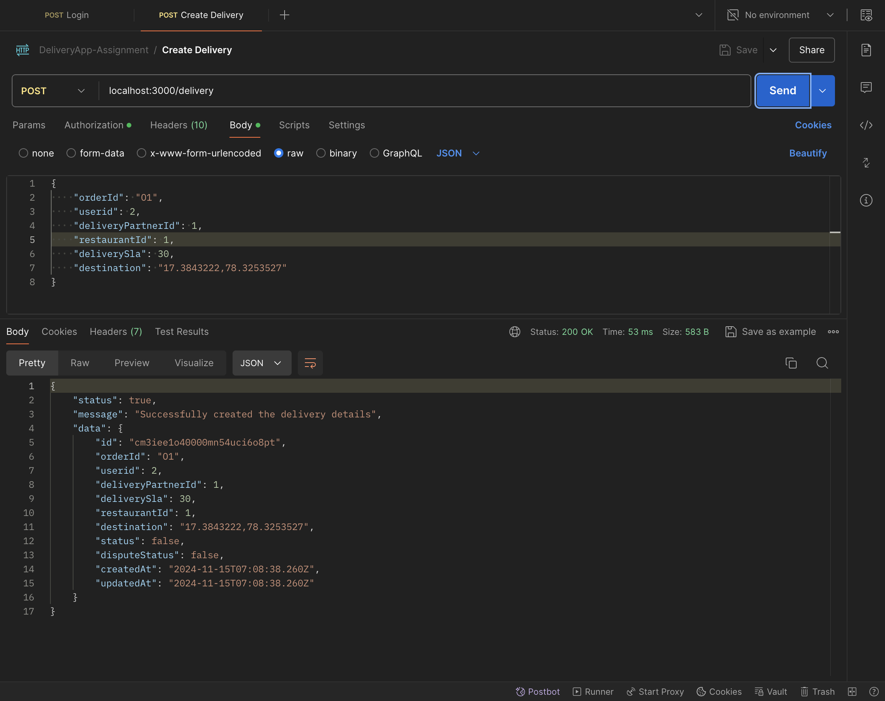

3. **Update delivery details**
    - **POST `/api/delivery/:id`**
    - **Description**: Updates delivery details for a given order (such as status, delivery agent, etc.).
    - **Request Body**:
      ```json
      {
        "deliverySla": 32,
        "status": true
      }
      ```
    - **Response**:
      ```json
      {
         "status": "boolean",
         "message": "string",
         "data": {
            "id": "string",
            "orderId": "string",
            "userid": "integer",
            "deliveryPartnerId": "integer",
            "deliverySla": "integer",
            "restaurant": "sreing",
            "destination": "string",
            "status": "boolean",
            "disputeStatus": "boolean",
            "createdAt": "timestamp",
            "updatedAt": "timestamp"
        }
      }
      ```


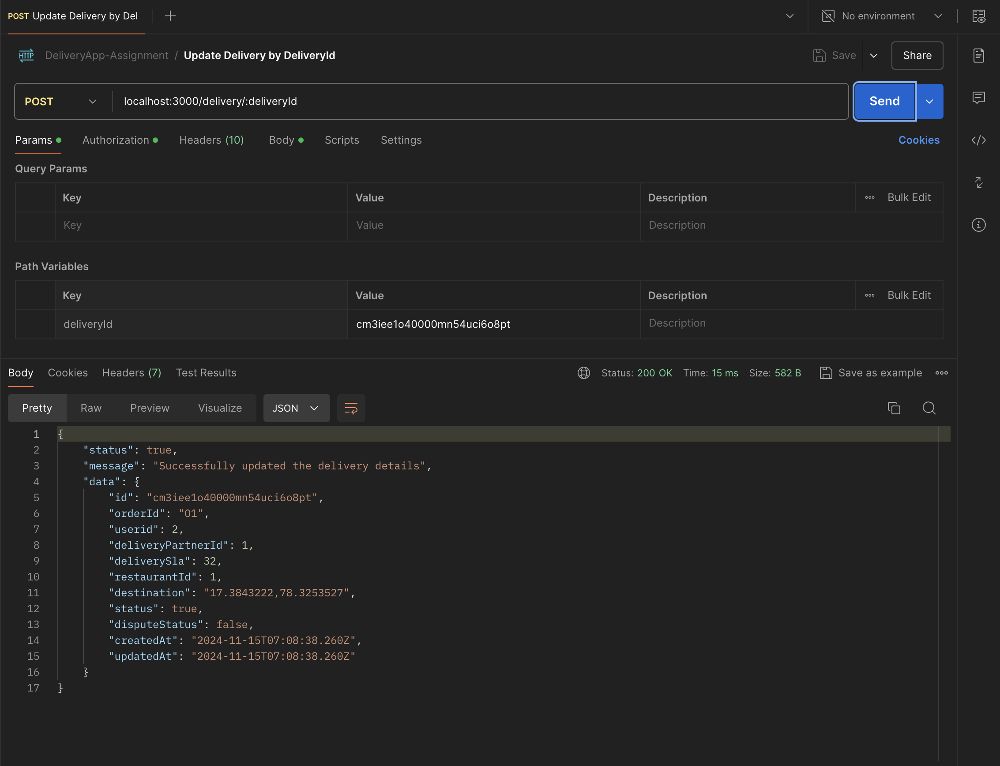

3. **Create a review for a delivery**
    - **POST `/api/delivery/review/:id`**
    - **Description**: Submit a review for a completed delivery.
    - **Request Body**:
      ```json
      {
        "rating": "integer",
        "message": "string"
      }
      ```
    - **Response**:
      ```json
      {
        "status": "boolean",
        "message": "string"
      }
      ```
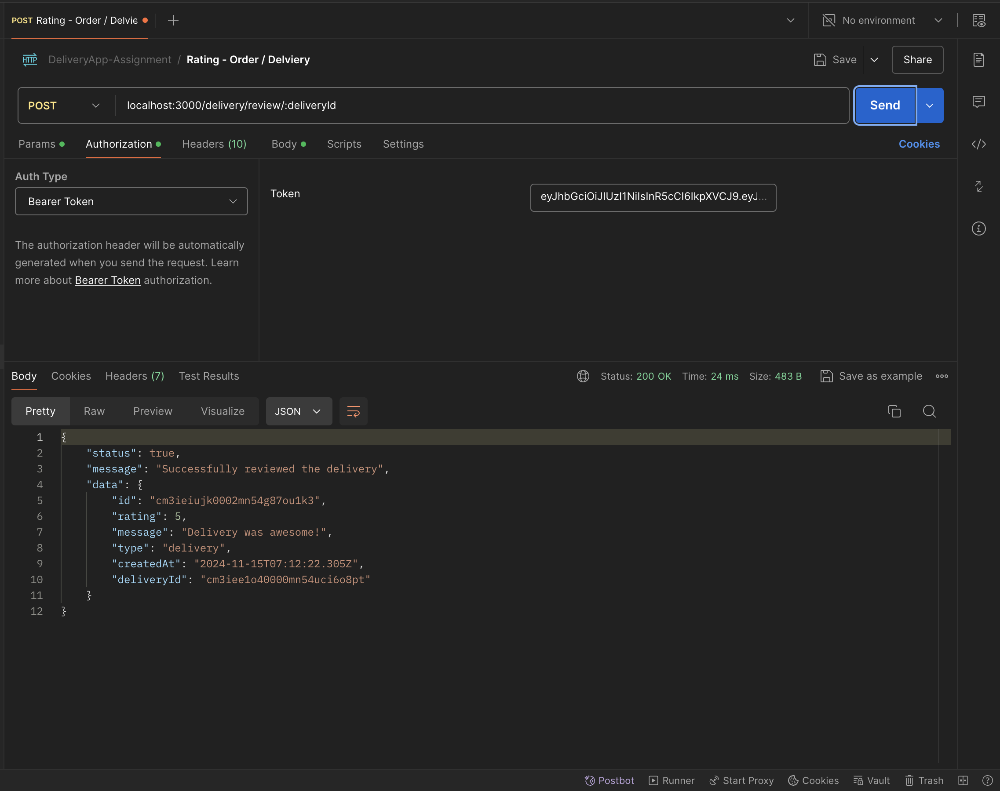

4. **Create or update a dispute**
    - **POST `/api/delivery/dispute/:id`**
    - **Description**: Initiates a dispute for a particular delivery (e.g., incorrect delivery or missed delivery).
    - **Request Body**:
      ```json
      {
        "message": "string"
       }
      ```
    - **Response**:
      ```json
      {
        "status": "boolean",
        "message": "string",
        "data": {
           "id": "string",
           "message": "string",
           "resolution": "string",
           "status": "boolean",
           "type": "string",
           "createdAt": "timestamp",
           "updatedAt": "timestamp",
           "deliveryId": "string"
        }
       }
      ```
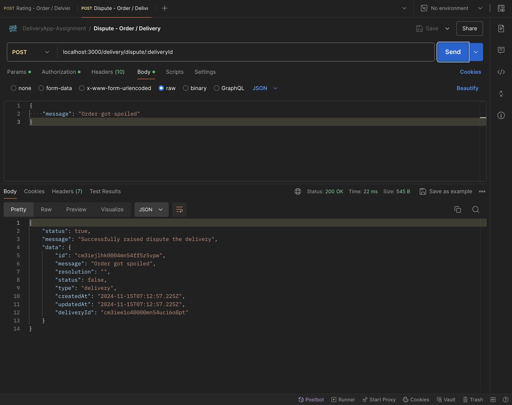

5. **Update a dispute**
    - **POST `/api/delivery/dispute/:id/update`**
    - **Description**: Update an existing dispute (status or resolution details).
    - **Request Body**:
      ```json
      {
        "resolution": "resolved",
        "status": "boolean"
      }
      ```
    - **Response**:
      ```json
      {
        "status": "boolean",
        "message": "string",
        "data": {
           "id": "string",
           "message": "string",
           "resolution": "string",
           "status": "boolean",
           "type": "string",
           "createdAt": "timestamp",
           "updatedAt": "timestamp",
           "deliveryId": "string"
        }
       }
      ```

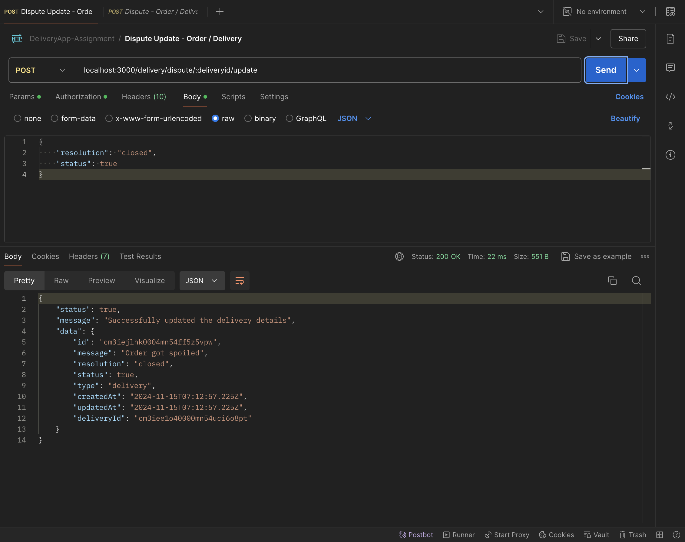


6. **Get delivery details**
    - **GET `/api/delivery/:id`**
    - **Description**: Retrieves the details of a specific delivery.
    - **Response**:
      ```json
      {
         "status": true,
         "message": "string",
         "data": {
            "id": "string",
            "orderId": "string",
            "userid": "integer",
            "deliveryPartnerId": "integer",
            "deliverySla": "integer",
            "restaurant": "string",
            "destination": "string",
            "status": "boolean",
            "disputeStatus": "boolean",
            "createdAt": "timestamp",
            "updatedAt": "timestamp",
            "rating": {
              "id": "string",
              "rating": "integer",
              "message": "string",
              "type": "string",
              "createdAt": "timestamp",
              "deliveryId": "string"
            },
            "dispute": {
               "id": "string",
               "message": "string",
               "resolution": "string",
               "status": "boolean",
               "type": "string",
               "createdAt": "timestamp",
               "updatedAt": "timestamp",
               "deliveryId": "string"
            }
           }
       }
      ```

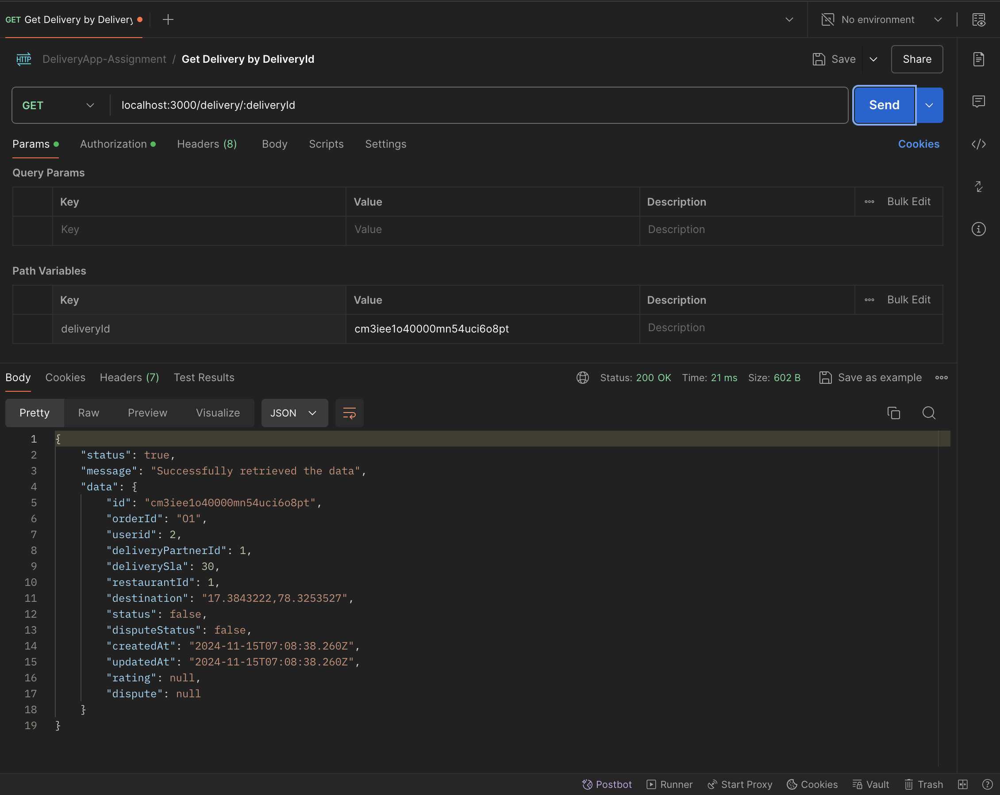


### Location Service

1. **Update location (for restaurant, order, or agent)**
    - **POST `/api/location/`**
    - **Description**: Updates the location of a restaurant, order, or delivery agent.
    - **Request Body**:
      ```json
      {
        "lat": "float", 
        "long": "float" 
      }
      ```
    - **Response**:
      ```json
      {
        "status": "boolean",
        "message": "string"
      }
      ```

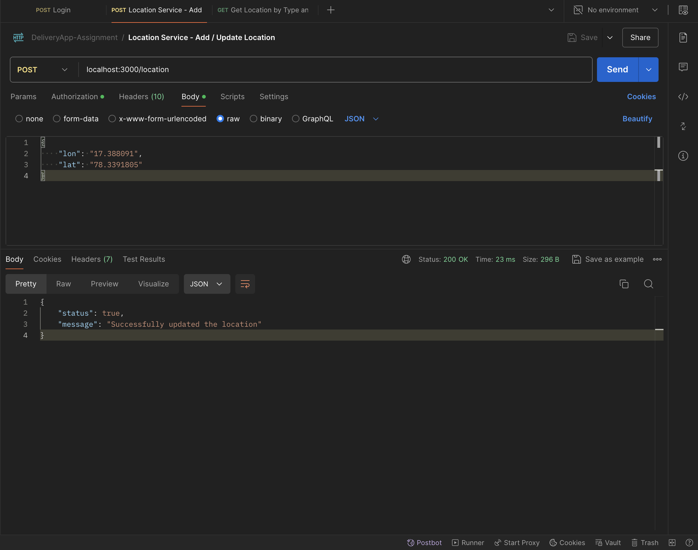

2. **Assign a delivery agent**
    - **POST `/api/location/assign`**
    - **Description**: Assigns the closest available delivery agent to the order based on geo-spatial indexing.
    - **Request Body**:
      ```json
      {
        "userId": "integer",
        "orderId": "string",
        "restaurantId": "string"
      }
      ```
    - **Response**:
      ```json
      {
        "message": "string",
        "deliveryAgentId": "string"
      }
      ```

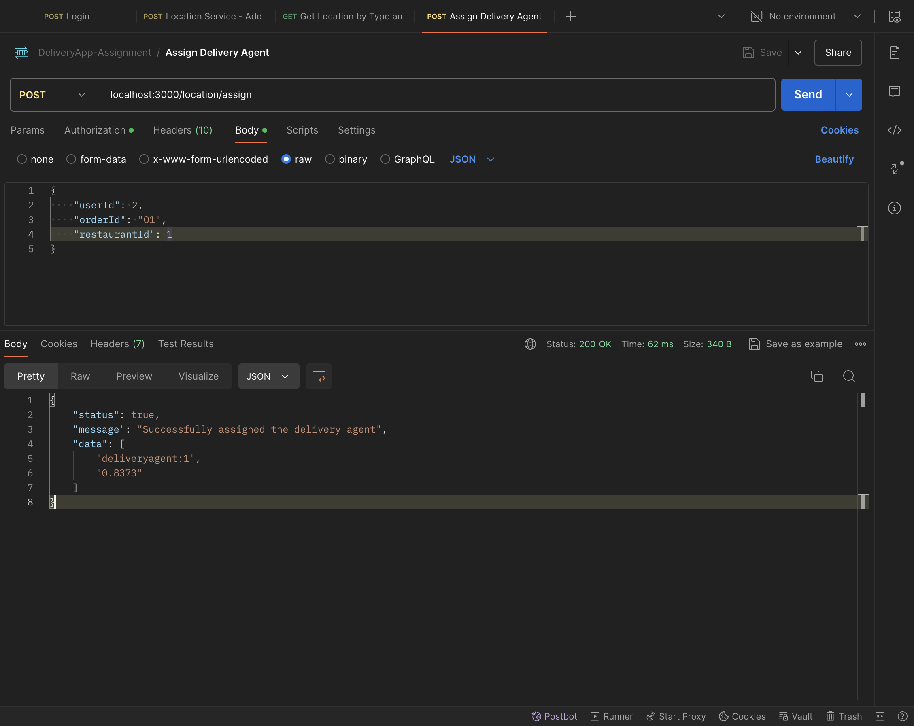

3. **Get location of a specific type (restaurant, order, agent)**
    - **GET `/api/location/:type/:id`**
    - **Description**: Retrieves the location details of a specific entity (restaurant, order, agent).
    - **Response**:
      ```json
      {
        "status": "boolean",
        "message": "string",
        "data": [
         [
           "float",
           "float"
         ]
       ]
      }
      ```

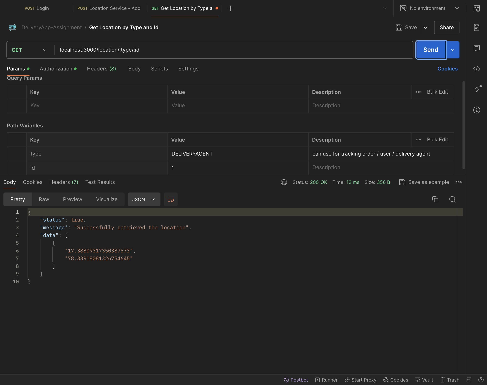
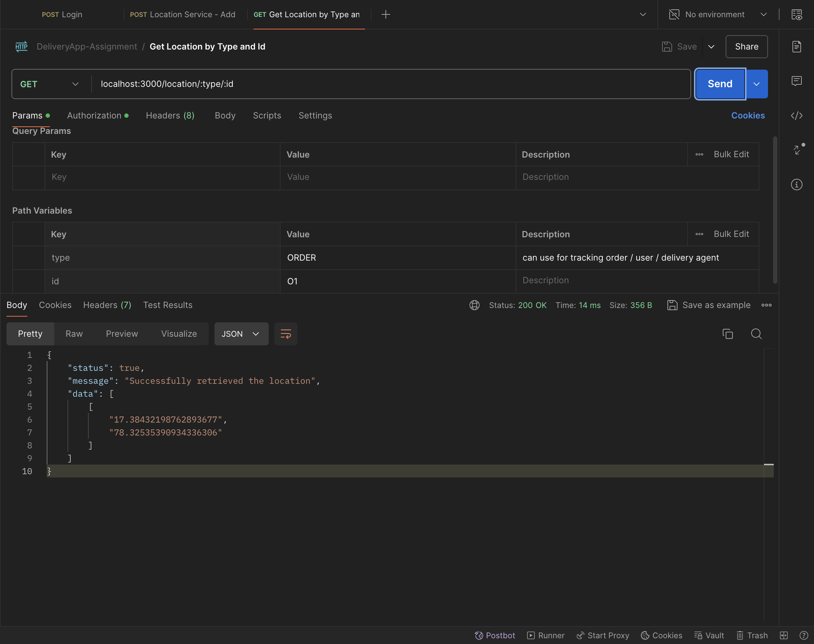
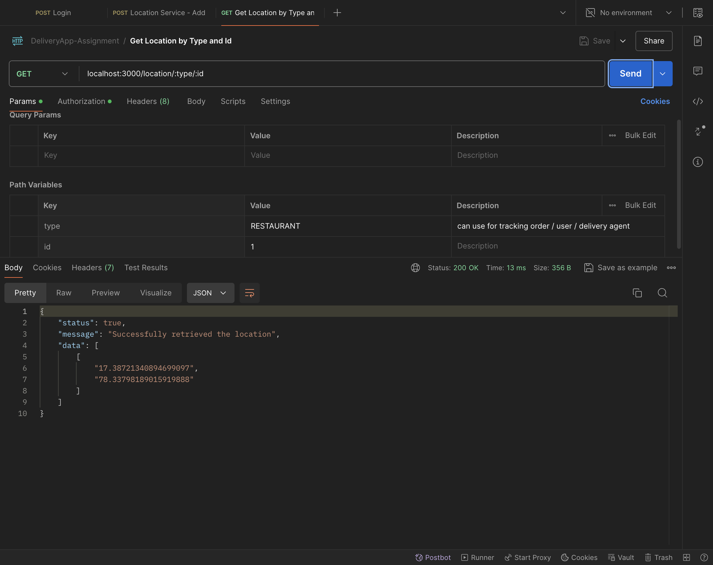

## Redis Geo-Spatial Indexing

The microservice leverages **Redis Geo-spatial indexing** to manage location data efficiently. The types of entities stored include:

- **Restaurants**: Location data for each restaurant is stored and updated regularly.
- **Orders**: The location of each order is updated to track the delivery status.
- **Delivery Agents**: The real-time location of delivery agents is tracked for assigning the closest one to an order.

### Geo Spatial Commands

- **GeoAdd**: Adds a new location for an entity (restaurant, order, or agent) to the Redis geo-spatial index.
- **GeoDistance**: Calculates the distance between two locations to determine the nearest agent to an order.

## Authentication

All API endpoints are protected by **JWT authentication**. A valid token must be included in the `Authorization` header for each request:

```bash
Authorization: Bearer <JWT_TOKEN>
```

## Error Handling

- **400 Bad Request**: Invalid input or missing parameters.
- **401 Unauthorized**: Invalid or expired JWT token.
- **404 Not Found**: Requested resource (delivery, order, location) does not exist.
- **500 Internal Server Error**: Unexpected errors in processing.

## Installation

1. Clone the repository:
2. Install dependencies:
   ```bash
   cd delivery-service
   npm install
   ```

3. Set up environment variables:
    - `DB_URL`: Database connection URL.
    - `REDIS_HOST`: Redis server host for geo-location tracking.
    - `REDIS_PORT`: Redis server port for geo-location tracking.
    - `JWT_SECRET`: Secret key for JWT authentication.

4. Start the service:
   ```bash
   npm start
   ```

The microservice will now be available at `http://localhost:3000`.

## Testing

For testing, you can use tools like Postman or CURL to make API calls. Ensure to include the **Authorization token** for all requests.

## API Test Cases

Here's a table of **Happy Path** and **Negative Test Cases** for the APIs.


| **API Name**                 | **Path**                          | **HTTP Status**  | **Test Case Type** | **Description**                                                                                                                                                      |
|------------------------------|-----------------------------------|------------------|--------------------|----------------------------------------------------------------------------------------------------------------------------------------------------------------------|
| **Create Delivery**           | `POST /`                          | 200 OK      | Happy Path         | Valid request with proper authorization creates a new delivery.                                                                                                      |
|                              |                                   | 400 Bad Request  | Negative           | Missing required fields (e.g., delivery details).                                                                                                                    |
| **Update Delivery**           | `POST /:id`                       | 200 OK           | Happy Path         | Valid request with proper delivery `id` and updated delivery data.                                                                                                 |
|                              |                                   | 404 Not Found    | Negative           | Delivery with specified `id` not found.                                                                                                                              |
|                              |                                   | 400 Bad Request  | Negative           | Invalid data for delivery update (e.g., malformed payload).                                                                                                         |
| **Create Review**             | `POST /review/:id`                | 200 Created      | Happy Path         | Successful review creation for a delivery using valid `id`.                                                                                                        |
|                              |                                   | 404 Not Found    | Negative           | Delivery with specified `id` for review does not exist.                                                                                                            |
|                              |                                   | 400 Bad Request  | Negative           | Invalid review data (e.g., rating or text missing).                                                                                                                 |
| **Create Dispute**            | `POST /dispute/:id`               | 200 OK      | Happy Path         | Dispute created for a delivery with valid `id`.                                                                                                                     |
|                              |                                   | 404 Not Found    | Negative           | No delivery found for the provided `id`.                                                                                                                             |
|                              |                                   | 400 Bad Request  | Negative           | Invalid dispute data (e.g., missing dispute reason).                                                                                                                |
| **Update Dispute**            | `POST /dispute/:id/update`        | 200 OK           | Happy Path         | Dispute successfully updated for the given `id`.                                                                                                                    |
|                              |                                   | 404 Not Found    | Negative           | No dispute found for the provided `id`.                                                                                                                              |
|                              |                                   | 400 Bad Request  | Negative           | Invalid data to update dispute (e.g., missing resolution details).                                                                                                  |
| **Get Delivery**              | `GET /:id`                        | 200 OK           | Happy Path         | Valid request for delivery details using the correct `id`.                                                                                                         |
|                              |                                   | 404 Not Found    | Negative           | No delivery found for the specified `id`.                                                                                                                            |
|                              |                                   | 401 Unauthorized | Negative           | Request without a valid authentication token.                                                                                                                       |
| **Update Location**           | `POST /`                          | 200 OK           | Happy Path         | Location updated successfully for the authenticated user.                                                                                                          |
|                              |                                   | 400 Bad Request  | Negative           | Invalid location data (e.g., malformed coordinates).                                                                                                                |
| **Assign Delivery**           | `POST /assign`                    | 200 OK           | Happy Path         | Delivery successfully assigned to a delivery person.                                                                                                               |
|                              |                                   | 400 Bad Request  | Negative           | Missing required fields (e.g., assignee or delivery details).                                                                                                      |
|                              |                                   | 404 Not Found    | Negative           | No delivery found to assign.                                                                                                                                         |
| **Get Location**              | `GET /:type/:id`                  | 200 OK           | Happy Path         | Successfully fetch location details for the given `type` and `id`.                                                                                                 |
|                              |                                   | 404 Not Found    | Negative           | Location for the given `type` and `id` does not exist.                                                                                                             |
|                              |                                   | 401 Unauthorized | Negative           | Invalid or missing authentication token.                                                                                                                             |


---

### Notes:

- **Redis Integration**: Ensure Redis is installed and configured for geo-spatial operations (`GEOADD`, `GEODIST`, etc.).
- **JWT Token**: The authentication token should be handled securely and passed with each request for protected endpoints.

---

This `README.md` provides a thorough overview of your delivery microservice, including its API, features, error handling, installation steps, and testing. You can adjust specific parts, like the database or Redis configuration, based on your actual implementation details.